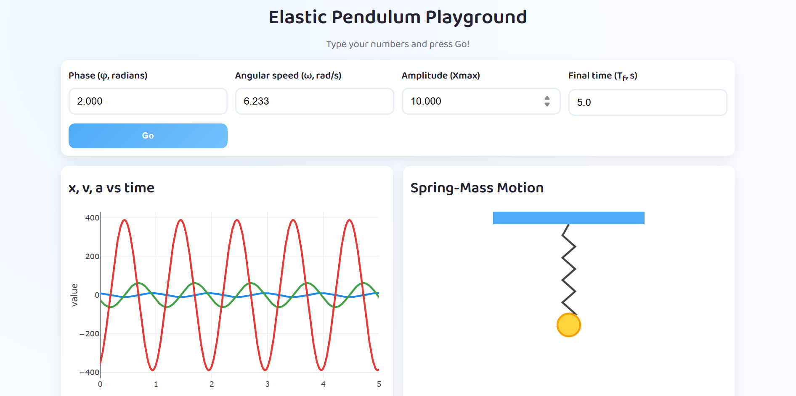

# Elastic Pendulum Playground

A colourful, beginner-friendly web app that lets nursery-age learners (and curious adults!) explore the motion of a mass on a spring.

Users supply just four numbers—phase angle φ, angular speed ω, amplitude X<sub>m</sub>, and final time T<sub>f</sub>—and the app instantly shows:

* An interactive Plotly graph of **x**, **v**, and **a** versus time.
* A cute SVG animation of the spring-mass bobbing up and down in sync.

Everything runs 100 % in the browser once the Flask server delivers the page—no extra clicks, libraries, or login needed.

---

## Table of Contents
1. [Features](#features)  
2. [Screenshots](#screenshots)  
3. [Quick Start](#quick-start)  
4. [How It Works](#how-it-works)  
5. [Project Structure](#project-structure)  
6. [Educational Notes](#educational-notes)  
7. [Contributing](#contributing)  
8. [License](#license)

---

## Features
✔ Four intuitive inputs—no damping or scary math for little ones.  
✔ Plotly panel showing displacement **x**, velocity **v**, and acceleration **a** on one axis.  
✔ Live SVG animation that matches the maths in real time.  
✔ Responsive design; looks great on tablets, laptops, and interactive whiteboards.  
✔ Zero external database or API dependencies—runs offline in the classroom.

## Screenshots


## Quick Start
```bash
# 1. Clone or download this repo
# 2. (Optional but recommended) create & activate a virtualenv
python -m venv .venv
source .venv/bin/activate  # Windows: .venv\Scripts\activate

# 3. Install dependencies
pip install -r requirements.txt

# 4. Launch the server
python app.py

# 5. Open your browser at http://127.0.0.1:5000
```

## How It Works
1. **Physics Engine** (`app.py → generate_motion_data`):
   * Uses the simple harmonic motion equations  
     `x = X_m sin(ωt + φ)`,  
     `v = X_m ω cos(ωt + φ)`,  
     `a = −X_m ω² sin(ωt + φ)`.
2. **Flask Route** (`/`):
   * Parses the four form fields, generates 600 samples up to T<sub>f</sub>, and embeds the data as JSON in the template.
3. **Front End** (`templates/index.html` + `static/styles.css`):
   * Renders the graph with Plotly.
   * Draws the spring-mass as SVG and drives it with `requestAnimationFrame`.

## Project Structure
```
├── app.py               # Flask app + physics
├── requirements.txt     # Flask 3.x, Plotly 5.x
├── templates/
│   └── index.html       # Jinja2 template, inline JS
├── static/
│   ├── styles.css       # Colourful UI
│   └── …
└── README.md            # You are here!
```

## Educational Notes
* **Waveforms**: Displacement, velocity, and acceleration are phase-shifted by ±90 ° and 180 ° respectively—clearly visible on the combined plot.
* **Parameter Exploration**: Encourage kids to double ω and watch the frequency change, or flip φ to see a half-period phase shift.
* **No Damping**: The current model omits damping for simplicity. A lightly damped version (already coded in comments) can be re-enabled for older students.

## Contributing
Pull requests are welcome! Feel free to open an issue to discuss improvements—new colour themes, better accessibility, multi-language support, etc.

## License
This project is released under the MIT License—see [LICENSE](LICENSE) for details.
